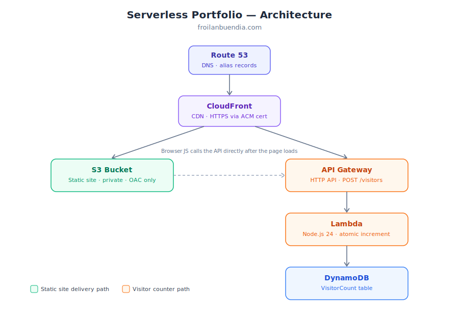

# froilanbuendia.com — Serverless Portfolio Website

A fully serverless personal portfolio site, built on AWS and deployed entirely through Infrastructure as Code. Every piece of infrastructure — hosting, CDN, DNS, and a visitor counter API — is defined in AWS CDK and deployed automatically via GitHub Actions on every push to `master`.

**Live site:** [https://froilanbuendia.com](https://froilanbuendia.com)

---

## Architecture



**Two independent request paths share the same domain:**

1. **Static site delivery** — Browser → Route 53 → CloudFront → S3 (private bucket, accessed only via CloudFront Origin Access Control).
2. **Visitor counter** — Browser JS → API Gateway → Lambda → DynamoDB, called client-side on page load to atomically increment and return a visit count.

---

## Tech Stack

| Layer           | Service                                                   | Notes                                                         |
| --------------- | --------------------------------------------------------- | ------------------------------------------------------------- |
| Frontend        | Next.js 16 (App Router, static export)                    | `output: "export"` — fully static, no server runtime required |
| Hosting         | Amazon S3                                                 | Private bucket, versioned, accessed only via CloudFront OAC   |
| CDN / TLS       | Amazon CloudFront                                         | HTTPS via ACM, custom domain aliases                          |
| DNS             | Amazon Route 53                                           | Domain registration + alias records                           |
| Certificates    | AWS Certificate Manager                                   | Must be provisioned in `us-east-1` for CloudFront             |
| Visitor counter | API Gateway (HTTP API) + Lambda (Node.js 24.x) + DynamoDB | Atomic `UpdateItem` increment, on-demand billing              |
| IaC             | AWS CDK (TypeScript)                                      | Entire stack defined as code, deployable from scratch         |
| CI/CD           | GitHub Actions + OIDC                                     | No long-lived AWS credentials stored in CI                    |

---

## Repository Structure

```
.
├── frontend/                  # Next.js application (source of the site itself)
│   ├── infra/                 # CDK app — all AWS infrastructure
│   │   ├── bin/infra.ts       # CDK app entry point
│   │   ├── lib/infra-stack.ts # Full stack definition
│   │   └── lambda/            # Visitor counter Lambda source
│   └── (Next.js app source)
└── .github/workflows/deploy.yml  # CI/CD pipeline
```

---

## Infrastructure as Code

The entire stack — S3 bucket, CloudFront distribution, Route 53 records, DynamoDB table, Lambda function, HTTP API, and the GitHub OIDC IAM role — is defined in a single CDK stack (`frontend/infra/lib/infra-stack.ts`). Nothing in this project was created by hand in the AWS Console in its final state; everything is reproducible with:

```bash
cd frontend/infra
npm install
cdk deploy
```

### Key design decisions

- **Origin Access Control (OAC)**, not a public S3 bucket or the older Origin Access Identity — CloudFront is the only principal allowed to read from the bucket, enforced via a `SourceArn`-scoped bucket policy.
- **Least-privilege IAM** throughout — the Lambda's execution role is scoped via `grantWriteData()` to exactly one DynamoDB table and one action, not broad DynamoDB access.
- **Existing DNS/cert resources are imported, not recreated** — the Route 53 hosted zone and ACM certificate were provisioned once and are referenced by CDK (`HostedZone.fromLookup`, `Certificate.fromCertificateArn`) rather than owned by the stack, since domain registration and cert issuance aren't well-suited to full CDK lifecycle management.
- **`RemovalPolicy.RETAIN`** on the S3 bucket and DynamoDB table — a `cdk destroy` won't silently wipe site content or visitor history.
- **CORS scoped to actual origins** (`https://froilanbuendia.com`, `https://www.froilanbuendia.com`, plus `localhost:3000` for local development) rather than a wildcard.
- **GitHub Actions authenticates via OIDC**, not stored AWS access keys — a short-lived token is exchanged per workflow run, nothing long-lived to leak if the repo were ever compromised.

---

## CI/CD Pipeline

On every push to `master`, [`.github/workflows/deploy.yml`](.github/workflows/deploy.yml) runs:

1. Assumes an AWS IAM role via GitHub's OIDC provider (no stored credentials)
2. Deploys any CDK infrastructure changes (`cdk deploy`)
3. Extracts the CloudFront distribution ID from CDK's own stack outputs
4. Builds the Next.js static export
5. Syncs the build output to S3
6. Invalidates the CloudFront cache so changes go live immediately

This means updating the site — content, styling, or infrastructure — is just:

```bash
git push origin master
```

---

## Visitor Counter

A small Lambda function performs an atomic DynamoDB `UpdateItem` with an `ADD` expression on every call, avoiding race conditions from concurrent visitors:

```javascript
UpdateExpression: "ADD #c :incr",
ExpressionAttributeValues: { ":incr": 1 },
```

The count is fetched client-side on page load and displayed subtly in the site footer.

---

## Estimated Cost

This project runs almost entirely within AWS's always-free tiers. Approximate monthly cost at low traffic:

| Item                                          | Cost                                 |
| --------------------------------------------- | ------------------------------------ |
| Route 53 hosted zone                          | ~$0.50/mo                            |
| S3, CloudFront, Lambda, API Gateway, DynamoDB | ~$0 (free tier)                      |
| Domain registration                           | ~$12–15/year (amortized ~$1–1.25/mo) |

**Total: roughly $1.50–2/month.**

---

## What This Project Demonstrates

- Designing a serverless architecture across compute, storage, networking, and DNS
- Infrastructure as Code with AWS CDK, including importing existing external resources into a stack
- Least-privilege IAM design (bucket policies, scoped Lambda execution roles)
- Secure CI/CD with OIDC federation instead of long-lived credentials
- Debugging real infrastructure issues under production-like constraints — CloudFront CNAME uniqueness conflicts, ACM's `us-east-1` requirement, npm lockfile drift breaking reproducible CI builds, and AWS Lambda runtime deprecation lifecycle management

---

## Local Development

```bash
cd frontend
npm install
npm run dev
```

Requires a `.env.local` file (see `.env.example`) with:

```
NEXT_PUBLIC_VISITOR_API_URL=<your API Gateway /visitors endpoint>
```

## Deploying From Scratch

1. Register a domain in Route 53
2. Request an ACM certificate in `us-east-1` for the domain and `www` subdomain, validated via DNS
3. Populate `frontend/infra/.env` (see `.env.example`) with your domain and certificate ARN
4. `cd frontend/infra && npm install && cdk bootstrap && cdk deploy`
5. Configure the GitHub repository secrets referenced in `.github/workflows/deploy.yml`
6. Push to `master`
